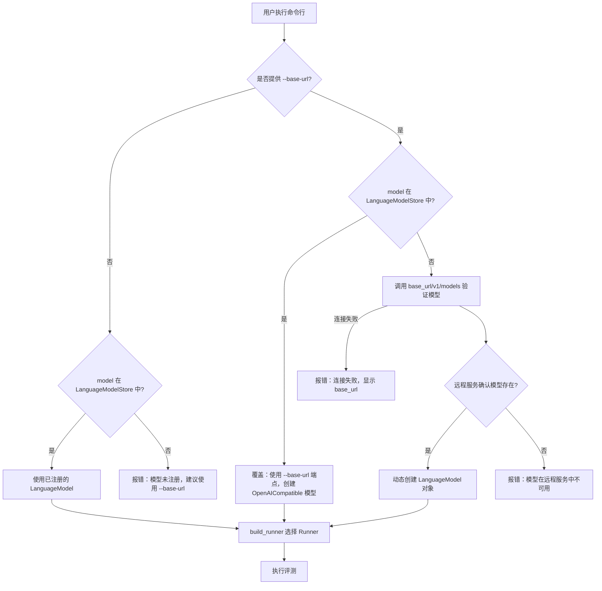

# 技术设计文档：OpenAI 兼容 API 支持

## 概述

本设计为 LiveCodeBench 添加通用的 OpenAI 兼容 API 支持。核心思路是：在 `LMStyle` 枚举中新增 `OpenAICompatible` 值，在命令行解析器中添加 `--base-url` 和 `--api-key` 参数，在 `main.py` 中实现动态模型查找逻辑（先查 `LanguageModelStore`，找不到时通过远程 `/v1/models` 端点验证），扩展 `OpenAIRunner` 以支持自定义 `base_url`，并在 `build_runner` 中添加路由。所有改动保持向后兼容。

## 架构

### 整体流程



### 变更范围

本功能涉及以下文件的修改：

| 文件 | 变更类型 | 说明 |
|------|----------|------|
| `lcb_runner/lm_styles.py` | 修改 | 新增 `OpenAICompatible` 枚举值 |
| `lcb_runner/runner/parser.py` | 修改 | 新增 `--base-url` 和 `--api-key` 参数 |
| `lcb_runner/runner/main.py` | 修改 | 添加动态模型查找与创建逻辑 |
| `lcb_runner/runner/oai_runner.py` | 修改 | 扩展 `OpenAIRunner` 支持自定义 `base_url` |
| `lcb_runner/runner/runner_utils.py` | 修改 | 添加 `OpenAICompatible` 路由 |

## 组件与接口

### 1. LMStyle 枚举扩展（`lm_styles.py`）

在 `LMStyle` 枚举中新增一个值：

```python
class LMStyle(Enum):
    # ... 现有值 ...
    OpenAICompatible = "OpenAICompatible"
```

无需在 `LanguageModelList` 中预注册任何模型，动态创建即可。

### 2. 命令行参数扩展（`parser.py`）

新增两个可选参数：

```python
parser.add_argument(
    "--base-url",
    type=str,
    default=None,
    help="OpenAI 兼容 API 的基础 URL（例如 http://localhost:11434/v1）",
)
parser.add_argument(
    "--api-key",
    type=str,
    default=None,
    help="OpenAI 兼容 API 的密钥（覆盖默认环境变量）",
)
```

这两个参数均为可选。`--base-url` 是触发 OpenAI 兼容模式的关键开关。

### 3. 动态模型查找与创建逻辑（`main.py`）

在 `main()` 函数中，替换原有的 `model = LanguageModelStore[args.model]` 为新的查找逻辑：

```python
def resolve_model(args):
    """根据命令行参数解析模型对象。"""
    if args.base_url:
        # 提供了 --base-url，进入 OpenAI 兼容模式
        if args.model in LanguageModelStore:
            # 已注册模型，但用户想用自定义端点覆盖
            pass  # 仍然创建新的 OpenAICompatible 模型
        else:
            # 未注册模型，需要通过远程验证
            validate_model_on_remote(args.model, args.base_url, args.api_key)

        return LanguageModel(
            model_name=args.model,
            model_repr=args.model,
            model_style=LMStyle.OpenAICompatible,
            release_date=None,
        )
    else:
        # 未提供 --base-url，走原有逻辑
        if args.model not in LanguageModelStore:
            print(
                f"错误：模型 '{args.model}' 未在 LanguageModelStore 中注册。\n"
                f"提示：使用 --base-url 参数指定 OpenAI 兼容 API 端点。"
            )
            sys.exit(1)
        return LanguageModelStore[args.model]
```

远程验证函数：

```python
def validate_model_on_remote(model_name, base_url, api_key):
    """通过 /v1/models 端点验证模型是否存在于远程服务中。"""
    import requests

    api_key = api_key or os.environ.get("OPENAI_API_KEY", "no-key-provided")
    headers = {"Authorization": f"Bearer {api_key}"}
    try:
        response = requests.get(f"{base_url}/models", headers=headers, timeout=10)
        response.raise_for_status()
        models_data = response.json()
        available_models = [m["id"] for m in models_data.get("data", [])]
        if model_name not in available_models:
            print(
                f"错误：模型 '{model_name}' 在远程服务 ({base_url}) 中不可用。\n"
                f"可用模型：{available_models}"
            )
            sys.exit(1)
    except requests.ConnectionError:
        print(f"错误：无法连接到 {base_url}，请检查服务是否运行。")
        sys.exit(1)
    except requests.RequestException as e:
        print(f"错误：查询 {base_url}/models 失败：{e}")
        sys.exit(1)
```

### 4. OpenAIRunner 扩展（`oai_runner.py`）

扩展 `OpenAIRunner`，在 `model_style` 为 `OpenAICompatible` 时使用实例级别的 `OpenAI` 客户端：

```python
class OpenAIRunner(BaseRunner):
    client = OpenAI(
        api_key=os.getenv("OPENAI_KEY"),
    )

    def __init__(self, args, model):
        super().__init__(args, model)

        if model.model_style == LMStyle.OpenAICompatible:
            # OpenAI 兼容模式：使用实例级别客户端
            api_key = args.api_key or os.environ.get("OPENAI_API_KEY", "no-key-provided")
            self.instance_client = OpenAI(
                api_key=api_key,
                base_url=args.base_url,
            )
            self.client_kwargs = {
                "model": args.model,
                "temperature": args.temperature,
                "max_tokens": args.max_tokens,
                "top_p": args.top_p,
                "n": args.n,
                "timeout": args.openai_timeout,
            }
        elif model.model_style == LMStyle.OpenAIReasonPreview:
            # ... 现有逻辑不变 ...
```

在 `_run_single` 中，根据是否存在 `instance_client` 选择客户端：

```python
def _run_single(self, prompt, n=10):
    client = getattr(self, "instance_client", OpenAIRunner.client)
    # ... 使用 client 发送请求 ...
```

### 5. Runner 路由扩展（`runner_utils.py`）

在 `build_runner` 函数中添加 `OpenAICompatible` 的路由，放在现有 `OpenAIChat` 路由之前：

```python
def build_runner(args, model):
    if model.model_style == LMStyle.OpenAICompatible:
        from lcb_runner.runner.oai_runner import OpenAIRunner
        return OpenAIRunner(args, model)
    if model.model_style == LMStyle.OpenAIChat:
        # ... 现有逻辑 ...
```

## 数据模型

### LanguageModel 数据结构

动态创建的 `LanguageModel` 对象结构如下：

```python
LanguageModel(
    model_name="用户通过 --model 指定的名称",   # 例如 "qwen2:7b"
    model_repr="用户通过 --model 指定的名称",    # 同 model_name，用作输出目录名
    model_style=LMStyle.OpenAICompatible,
    release_date=None,                          # 动态模型无发布日期
)
```

### 命令行参数扩展

`args` 命名空间新增以下属性：

| 属性 | 类型 | 默认值 | 说明 |
|------|------|--------|------|
| `base_url` | `str \| None` | `None` | OpenAI 兼容 API 基础 URL |
| `api_key` | `str \| None` | `None` | API 密钥 |

### API 密钥优先级

1. `--api-key` 命令行参数（最高优先级）
2. `OPENAI_API_KEY` 环境变量
3. `"no-key-provided"` 占位符（用于不需要认证的本地服务）


## 正确性属性

*属性是在系统所有有效执行中都应成立的特征或行为——本质上是关于系统应该做什么的形式化陈述。属性是人类可读规范与机器可验证正确性保证之间的桥梁。*

### 属性 1：--base-url 触发 OpenAI 兼容模式

*对于任意*模型名称（无论是否在 LanguageModelStore 中注册），当提供了 `--base-url` 参数时，`resolve_model` 返回的 LanguageModel 对象的 `model_style` 应为 `LMStyle.OpenAICompatible`。

**验证需求：2.3, 5.4**

### 属性 2：无 --base-url 时保持现有行为

*对于任意* LanguageModelStore 中已注册的模型名称，当未提供 `--base-url` 参数时，`resolve_model` 返回的 LanguageModel 对象应与 `LanguageModelStore[model_name]` 完全一致（同一对象引用）。

**验证需求：2.4, 5.1**

### 属性 3：动态创建 LanguageModel 的正确性

*对于任意*非空模型名称字符串，当通过 OpenAI 兼容模式动态创建 LanguageModel 时，创建的对象应满足：`model_name == args.model`，`model_repr == args.model`，`model_style == LMStyle.OpenAICompatible`，`release_date is None`。

**验证需求：3.2, 3.4**

### 属性 4：Runner 使用用户指定的 base_url

*对于任意*合法的 URL 字符串作为 `base_url`，当模型风格为 `OpenAICompatible` 时，OpenAIRunner 的实例客户端的 `base_url` 应等于用户指定的值。

**验证需求：4.1**

### 属性 5：API 密钥优先级解析

*对于任意* `--api-key` 参数值和 `OPENAI_API_KEY` 环境变量值的组合，Runner 使用的 API 密钥应遵循以下优先级：(1) `--api-key` 参数值（若提供），(2) `OPENAI_API_KEY` 环境变量值（若设置），(3) `"no-key-provided"` 占位符。

**验证需求：4.2, 4.3**

### 属性 6：采样参数正确传递

*对于任意*合法的采样参数组合（temperature ∈ [0,2]，max_tokens > 0，top_p ∈ [0,1]，n > 0），OpenAI 兼容 Runner 的 `client_kwargs` 应包含这些参数且值与输入一致。

**验证需求：4.5**

### 属性 7：已注册模型路由保持不变

*对于任意* LanguageModelStore 中已注册的模型，当未提供 `--base-url` 时，`build_runner` 返回的 Runner 类型应与该模型的 `model_style` 对应的原有 Runner 类型一致。

**验证需求：5.2**

## 错误处理

### 错误场景与处理策略

| 场景 | 触发条件 | 处理方式 | 退出码 |
|------|----------|----------|--------|
| 模型未注册且无 --base-url | `args.model not in LanguageModelStore and not args.base_url` | 打印错误信息，建议使用 --base-url | 1 |
| 远程模型不存在 | `/v1/models` 返回的列表中不包含指定模型 | 打印错误信息，列出可用模型 | 1 |
| 远程服务连接失败 | `requests.ConnectionError` | 打印包含 base_url 的连接错误信息 | 1 |
| 远程服务请求异常 | `requests.RequestException` | 打印包含 base_url 和异常详情的错误信息 | 1 |
| 评测过程中 API 调用失败 | OpenAI SDK 抛出连接/超时异常 | 打印包含 base_url 的错误信息，按现有重试逻辑处理 | 不退出，重试 |

### 错误信息格式

所有错误信息应包含：
- 明确的错误描述
- 相关的 URL 或模型名称
- 可操作的修复建议

示例：
```
错误：模型 'my-model' 未在 LanguageModelStore 中注册。
提示：使用 --base-url 参数指定 OpenAI 兼容 API 端点。
例如：python -m lcb_runner.runner.main --model my-model --base-url http://localhost:11434/v1
```

```
错误：无法连接到 http://localhost:11434/v1，请检查服务是否运行。
```

## 测试策略

### 双重测试方法

本功能采用单元测试与属性测试相结合的方式：

- **单元测试**：验证具体示例、边界情况和错误条件
- **属性测试**：验证跨所有输入的通用属性

### 属性测试配置

- 属性测试库：[hypothesis](https://hypothesis.readthedocs.io/)（Python 生态最成熟的属性测试库）
- 每个属性测试最少运行 100 次迭代
- 每个属性测试必须通过注释引用设计文档中的属性编号
- 标签格式：**Feature: openai-compatible-api-support, Property {number}: {property_text}**
- 每个正确性属性由一个属性测试实现

### 单元测试覆盖

单元测试聚焦于：
- `LMStyle.OpenAICompatible` 枚举值存在性（需求 1.1）
- `--base-url` 和 `--api-key` 参数解析（需求 2.1, 2.2）
- `build_runner` 对 `OpenAICompatible` 的路由（需求 1.2）
- 远程 `/v1/models` 端点调用逻辑（需求 3.1，使用 mock）
- 错误场景：模型未注册无 --base-url（需求 6.1）
- 错误场景：远程模型不存在（需求 6.2）
- 错误场景：远程连接失败（需求 6.3）
- 错误场景：评测过程中连接失败（需求 6.4）

### 属性测试覆盖

每个正确性属性对应一个属性测试：

| 属性 | 测试描述 | 生成器 |
|------|----------|--------|
| 属性 1 | --base-url 触发 OpenAI 兼容模式 | 随机模型名称 + 随机 URL |
| 属性 2 | 无 --base-url 保持现有行为 | 从 LanguageModelStore 随机选取模型名称 |
| 属性 3 | 动态 LanguageModel 创建正确性 | 随机非空字符串作为模型名称 |
| 属性 4 | Runner base_url 初始化 | 随机合法 URL |
| 属性 5 | API 密钥优先级 | 随机字符串组合（api_key, env_var, 或 None） |
| 属性 6 | 采样参数传递 | 随机 temperature/max_tokens/top_p/n |
| 属性 7 | 已注册模型路由不变 | 从 LanguageModelStore 随机选取模型 |
